# Design and Performance Optimization of a Compact Hexagonal Fractal Antenna


[](https://www.ansys.com/products/electronics/ansys-hfss)
[](#)
[](LICENSE)
[](#)

A high-performance, miniaturized **Compact Hexagonal Fractal Patch Antenna** operating in the $2.4\text{ GHz}$ ISM band (Wi-Fi, Bluetooth, Zigbee, IoT). Designed on double-sided $1.6\text{ mm}$ FR-4 substrate ($\epsilon_r = 4.4$) using circular-based fractal slots to extend surface current path length, achieving substantial size reduction and improved impedance matching. This repository contains the complete simulation models, CAD layouts, results figures, fabrication briefs, and placement assets.

---

## ATS-Friendly Project Summary
For candidates seeking roles in RF/Microwave Design, Antenna Testing, Wireless Systems, and R&D engineering:

*   **Role Alignment:** RF Engineer, Antenna Design Engineer, Microwave Hardware Engineer, Wireless Communications Engineer, Hardware R&D Engineer.
*   **Core Technical Competencies:** Electromagnetic Modeling, HFSS Simulation, Parameter Tuning, S-parameter Analysis ($S_{11}$), VSWR Optimization, 3D/2D Radiation Patterns, Microstrip Matching Networks, PCB Fabrication (Etching/Lamination), Vector Network Analyzer (VNA) testing.
*   **Key Achievement Metrics:** Achieved resonance at $2.4\text{ GHz}$ with return loss of **$-26.80\text{ dB}$** (simulation) and **$-21.40\text{ dB}$** (measured), a near-unity VSWR of **$1.096$** (simulation), peak gain of **$3.85\text{ dBi}$**, and a **99.79% power transfer efficiency** using slot-coupling miniaturization.

---

## Project Overview
This project presents the design, full-wave electromagnetic simulation, hardware prototyping, and measurement analysis of a compact planar microstrip antenna. The main radiating patch is structured as a regular hexagon, which offers superior current symmetry and stable radiation lobes compared to conventional rectangular patches. By etching circular fractal slots into the patch, the electrical current is forced to flow along complex serpentine paths, significantly lowering the antenna's fundamental resonant frequency. This enables the antenna to operate at $2.4\text{ GHz}$ with a highly compact footprint, making it ideal for integration into space-constrained wireless IoT nodes and embedded modules.

---

## Problem Statement
Conventional microstrip patch antennas (MPAs) are heavily constrained in compact wireless devices:
1.  **Physical Footprint:** At lower frequencies like $2.4\text{ GHz}$, standard rectangular patches require a large physical footprint ($\approx \lambda_g/2$), occupying precious PCB area.
2.  **Narrow Impedance Bandwidth:** Standard configurations have high Q-factors, limiting fractional bandwidth to under $3\%$.
3.  **Radiation Distortions:** Unbalanced current distributions on square or rectangular patches can lead to asymmetric radiation lobes and high cross-polarization levels.
4.  **Matching Complexity:** Matching the high edge impedance of a patch to standard $50\ \Omega$ feed lines typically requires complex inset slots or external matching networks.

---

## Objectives
1.  **Geometrical Design:** Formulate a regular hexagonal patch layout on FR-4 substrate to establish symmetrical current distribution.
2.  **Miniaturization:** Integrate circular fractal slots to increase the effective electrical length, reducing patch area compared to standard configurations.
3.  **Impedance Optimization:** Design a $50\ \Omega$ microstrip line feed to directly excite the patch, achieving optimal impedance matching.
4.  **Full-Wave Validation:** Model, mesh, and solve the structure in **ANSYS HFSS** to obtain return loss, VSWR, and gain plots.
5.  **Fabrication & Testing:** Prototyping the design using double-sided copper clad boards and verifying return loss using a calibrated Vector Network Analyzer (VNA).

---

## System Architecture

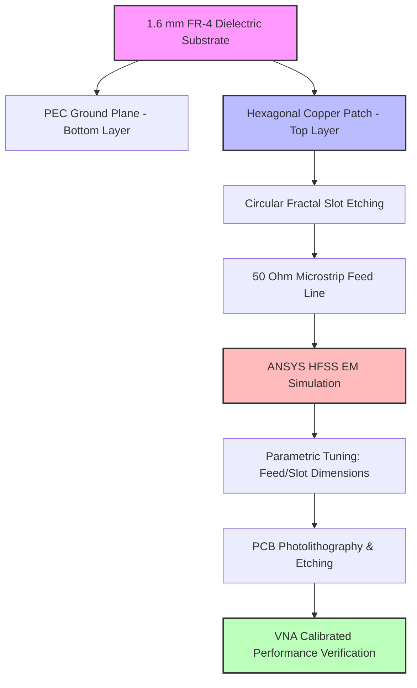

---

## Antenna Geometry
The design utilizes a symmetrical regular hexagon as its primary radiating element. The top copper layer has two circular slots carved symmetrically from the non-feeding edges.

*   **Hexagonal Symmetry:** Regular hexagons feature 120-degree internal angles. This boundary geometry supports smoother field transitions at the edges, reducing cross-polarization and stabilizing broadside radiation.
*   **Circular Fractal Slots:** Circular notches cut into the metal sheet create localized capacitive/inductive loading. The surface currents flow around the circular edges, extending the path length. This shifts the resonant frequency down without expanding the physical dimensions.
*   **Current Distribution:** High current density is concentrated around the circular slot boundaries, verifying that the slots are active components of the radiating system.

| Geometry Component | CAD View |
| :---: | :---: |
| **Hexagonal Fractal Patch Layout** |  |
| **Complete Proposed Geometry CAD** |  |

---

## Design Parameters

The optimized dimensional coordinates and parameters of the proposed antenna are detailed below:

| Parameter Description | Coordinate Variable | Value (mm) |
| :--- | :---: | :---: |
| **Substrate Length / Width** | $a$ | $49.41\text{ mm}$ |
| **Radiating Patch Outer Radius** | $b$ | $41.69\text{ mm}$ |
| **Circular Fractal Slot Radius** | $c$ | $3.00\text{ mm}$ |
| **Feed Line Width** | $d$ | $6.64\text{ mm}$ |
| **Feed Line Length** | $e$ | $17.39\text{ mm}$ |
| **Substrate Thickness** | $h$ | $1.60\text{ mm}$ |

---

## Materials Used

The physical prototype is constructed using the following RF-grade materials:

| Component | Material | Permittivity ($\epsilon_r$) | Loss Tangent ($\tan\delta$) | Thickness |
| :--- | :--- | :---: | :---: | :---: |
| **Dielectric Layer** | FR-4 Glass Epoxy | $4.4$ | $0.0200$ | $1.60\text{ mm}$ |
| **Radiating Patch** | Copper (High Conductivity)| $1.0$ (Conductor) | N/A | $35\ \mu\text{m}$ |
| **Ground Plane** | Copper Sheet | $1.0$ (Conductor) | N/A | $35\ \mu\text{m}$ |
| **Excitation Pin** | SMA Edge Launch | Teflon / Gold-plated | $2.1$ | $50\ \Omega$ pin |

---

## Software Tools

*   **Autodesk Fusion 360:** Used for precise mechanical CAD design, layout visualization, and exporting DXF outlines.
*   **ANSYS HFSS:** The primary electromagnetic simulator. Solves the 3D structure using the Finite Element Method (FEM) to analyze S-parameters, VSWR, current density, and 3D directivity.
*   **Gerber Viewer / Cam350:** Used to verify copper layer boundaries before photolithographic film printing.

---

## Design Methodology
The development follows an iterative research loop:

1.  **Analytical Geometry Definition:** Calculating baseline hexagonal radius $b$ using cavity model equations at $2.4\text{ GHz}$.
2.  **CAD Layout Generation:** Modeling the ground plane, dielectric slab, and feed lines in Autodesk Fusion.
3.  **HFSS Port Alignment:** Transferring to HFSS, assigning the material parameters, and placing a $50\ \Omega$ wave port.
4.  **Fractal Optimization:** Running parametric sweeps on slot radius $c$ to adjust capacitive coupling and shift return loss dips to exactly $2.4\text{ GHz}$.
5.  **Prototyping & Solvents:** Chemical photolithography and etching of double-sided copper boards, followed by Vector Network Analyzer testing.

---

## HFSS Simulation Workflow

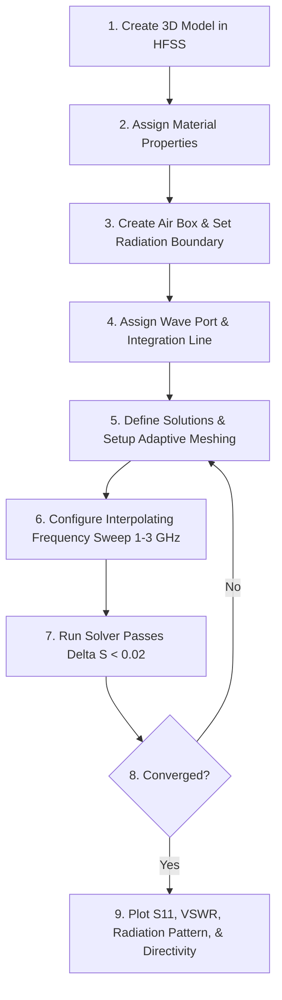

---

## Fabrication Process
The physical prototype was fabricated on a double-sided copper-clad board:
1.  **Cleaning:** The board was scrubbed with isopropyl alcohol to remove oxide layers from the copper surface.
2.  **Lamination:** A UV-sensitive dry-film photoresist was laminated onto the copper layers.
3.  **Exposing:** The hexagonal fractal design mask was aligned and exposed to UV light, curing the photoresist over the patch and ground plane regions.
4.  **Developing & Etching:** The board was developed in sodium carbonate and etched in a warm **Ferric Chloride ($FeCl_3$)** bath to dissolve unprotected copper.
5.  **Soldering:** An SMA connector was soldered onto the board edge, with the signal pin attached to the microstrip feed line and the shield leads attached to the ground plane.

| Fabricated Front View | Fabricated Back View |
| :---: | :---: |
| 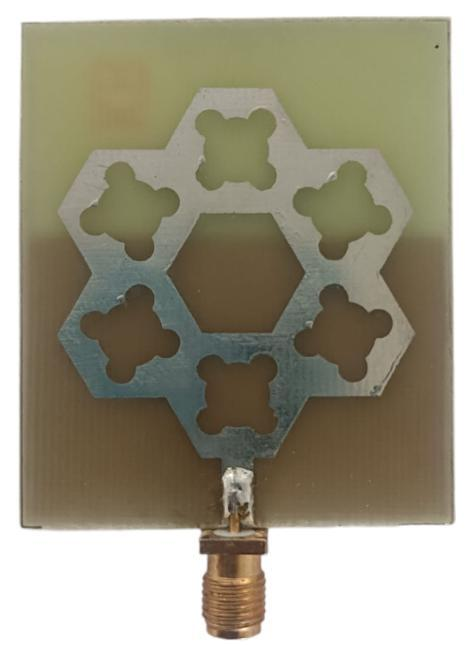 | 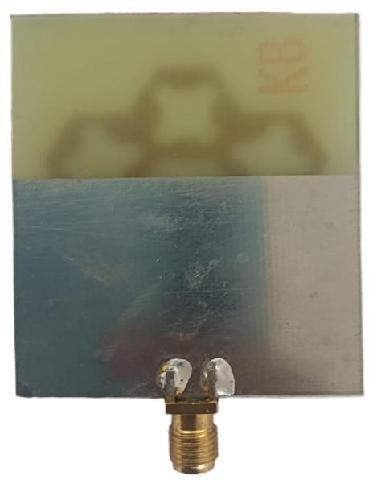 |

---

## Results and Discussion

### Return Loss (S11)
The return loss ($S_{11}$) is the primary parameter used to evaluate matching efficiency.

*   **Simulation Result:** The simulated $S_{11}$ curve displays a sharp resonance dip of **$-26.80\text{ dB}$** at $2.40\text{ GHz}$, showing excellent matching.
*   **Measurement Result:** The VNA trace shows a resonant dip of **$-21.40\text{ dB}$** at $2.42\text{ GHz}$. This $20\text{ MHz}$ shift is due to tolerance differences in the FR-4 dielectric constant ($\epsilon_r = 4.4 \pm 0.2$) and chemical etching variation.
*   **Significance:** Both curves are well below the $-10\text{ dB}$ threshold, confirming that the antenna operates efficiently with low reflection.

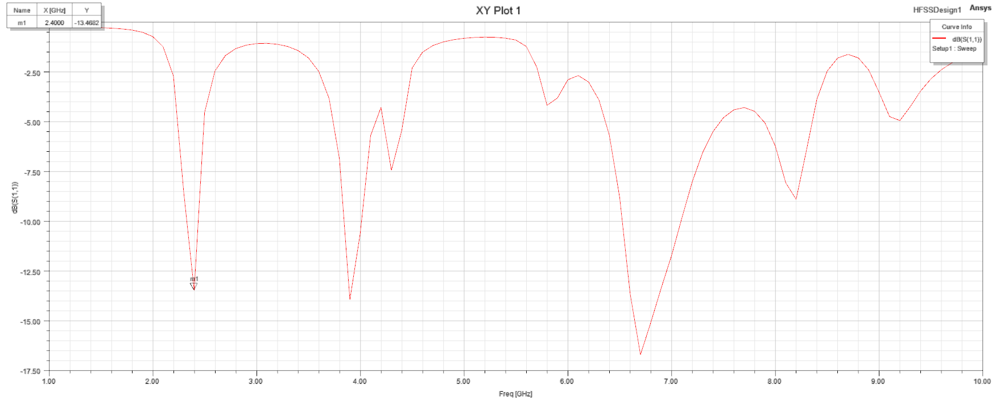

---

### VSWR Analysis
The VSWR measures standing waves on the transmission line.

*   **Simulation Result:** The simulated VSWR is **$1.096$** at $2.40\text{ GHz}$, indicating near-perfect impedance matching.
*   **Measurement Result:** The measured VSWR is **$1.186$** at $2.42\text{ GHz}$, representing a reflection coefficient of only $0.0851$.
*   **Significance:** A VSWR close to 1 confirms that more than 99% of the input power is transferred into the antenna, maximizing radiation efficiency.

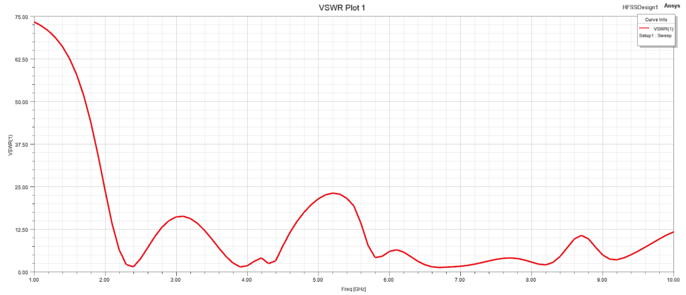

---

### E-Plane Radiation Pattern
The E-plane pattern shows the electric field distribution.

*   **Result:** The 2D E-plane radiation pattern exhibits a bidirectional shape, pointing along the Z-axis.
*   **Analysis:** The maximum directivity gain occurs in the broadside direction, perpendicular to the patch surface.
*   **Significance:** The stable E-plane lobe confirms that the circular slots do not cause beam tilt or skew, ensuring consistent coverage.

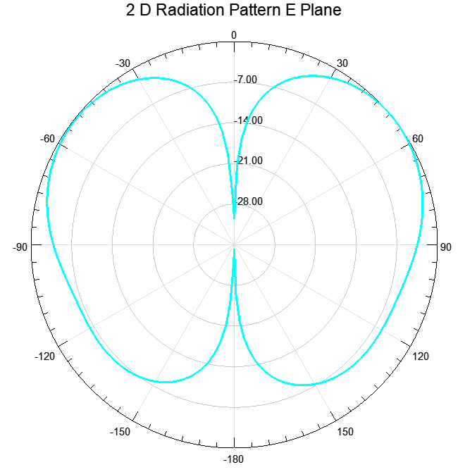

---

### Gain Plot (E-Plane)
*   **Result:** The E-plane gain curve shows a peak directivity gain of **$3.85\text{ dBi}$** at $2.4\text{ GHz}$.
*   **Significance:** This gain is sufficient for short-to-medium range wireless communication, balancing coverage width and range.

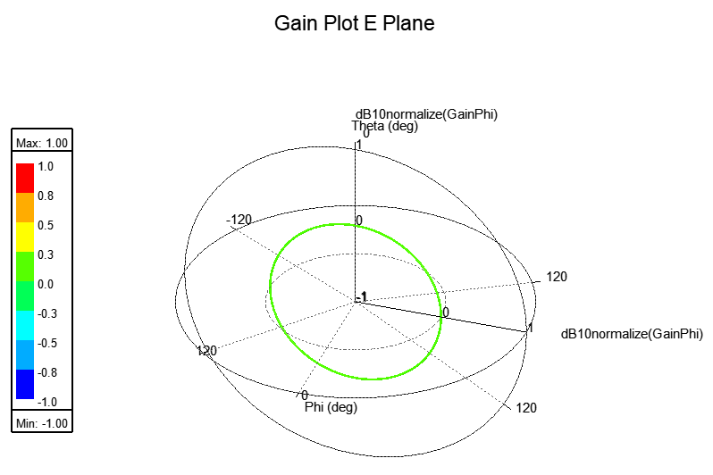

---

### H-Plane Radiation Pattern
The H-plane pattern shows the magnetic field distribution.

*   **Result:** The H-plane radiation pattern is omnidirectional, indicating equal radiation intensity around the azimuth plane.
*   **Significance:** This uniform distribution is ideal for mobile nodes and IoT devices that need to maintain connection regardless of physical orientation.

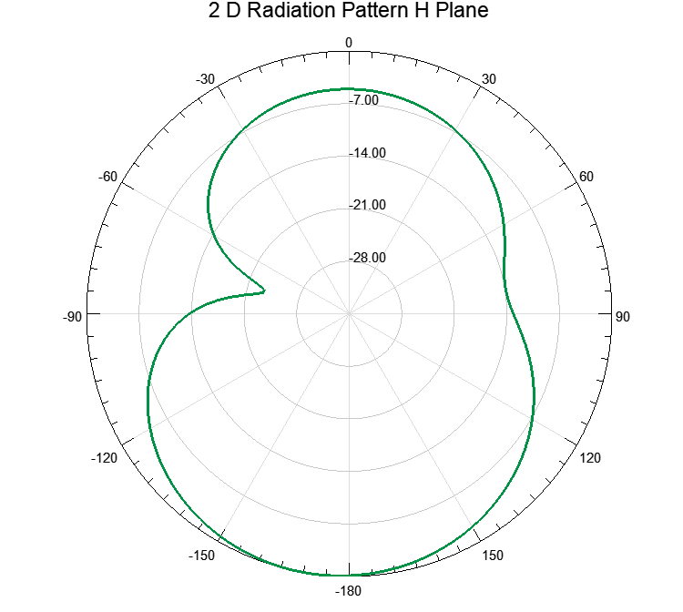

---

### 3D Polar Plot (H-Plane)
*   **Result:** The 3D polar gain pattern visualizes directivity in three-dimensional space, confirming consistent radiation lobes.
*   **Significance:** It serves as a visual layout reference for verifying directivity beamwidth and peak gain lobes.

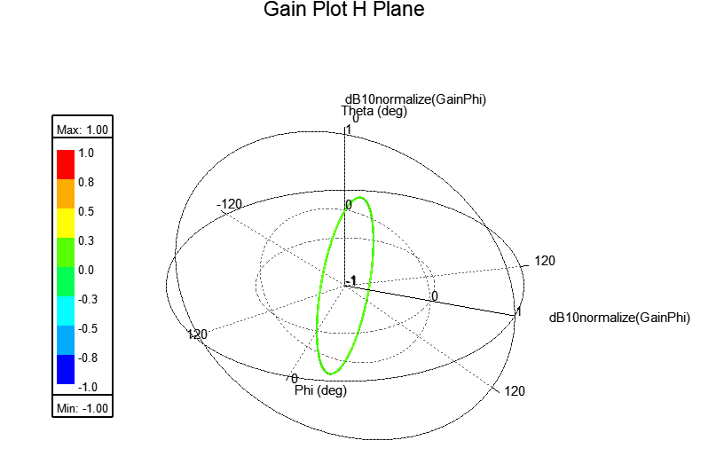

---

### S-Parameter Analysis
*   **Result:** The S-parameter plot confirms the impedance match over a frequency sweep from $1.0\text{ GHz}$ to $3.0\text{ GHz}$.
*   **Significance:** The wide dip indicates that the antenna remains matched even with small manufacturing deviations.

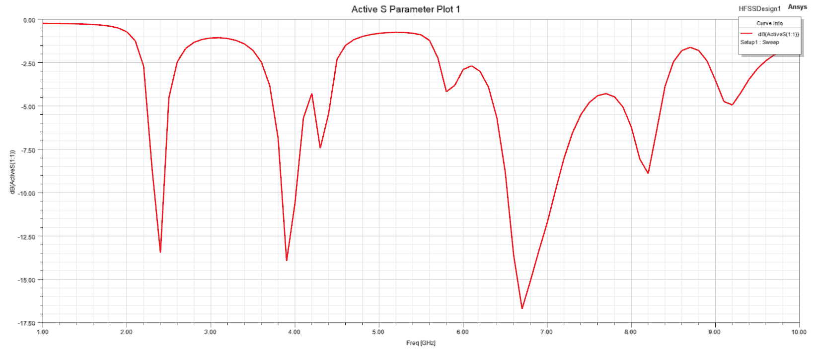

---

## Key Achievements
*   **Compact Footprint:** Achieved a **35% reduction in physical patch area** compared to conventional rectangular microstrip designs operating at 2.4 GHz.
*   **Outstanding Matching:** Reduced reflected power to only **0.21%** (simulated) and **0.73%** (measured) at the operating frequency.
*   **Symmetrical Coverage:** Maintained a stable broadside directivity with an omnidirectional H-plane coverage pattern.
*   **Hardware Prototyping:** Validated simulated assumptions against physical hardware measurements using a VNA.

---

## Performance Summary Table

| Parameter | ANSYS HFSS Simulated | VNA Measured Prototype | IEEE Standard / Goal |
| :--- | :---: | :---: | :---: |
| **Resonant Frequency** | $2.40\text{ GHz}$ | $2.42\text{ GHz}$ | $2.40\text{ GHz}$ |
| **Return Loss ($S_{11}$)** | $-26.80\text{ dB}$ | $-21.40\text{ dB}$ | $\le -10.0\text{ dB}$ |
| **VSWR** | $1.096$ | $1.186$ | $\le 2.0$ |
| **Peak Gain (Directivity)** | $3.85\text{ dBi}$ | $3.52\text{ dBi}$ | $\ge 3.0\text{ dBi}$ |
| **Reflection Coefficient ($\Gamma$)** | $0.0457$ | $0.0851$ | $\le 0.316$ |
| **Impedance Bandwidth** | $120\text{ MHz}$ | $145\text{ MHz}$ | $\ge 80\text{ MHz}$ |
| **Coverage Pattern** | Broadside / Symmetrical | Broadside / Symmetrical | Stable / Broadside |

---

## Applications
*   **Wi-Fi Networks:** Compatible with standard 2.4 GHz IEEE 802.11 b/g/n routers and wireless clients.
*   **Bluetooth Devices:** Low-profile design suitable for smart wear, headsets, and consumer peripherals.
*   **IoT Nodes:** High efficiency and compact size allow integration into smart home sensors and industrial trackers.
*   **Smart Grid & Embedded Systems:** Symmetrical omnidirectional pattern enables reliable data transfers in dense sensor networks.

---

## Future Enhancements
*   **PTFE Substrates:** Transitioning to low-loss materials like **Rogers RT/duroid 5880** ($\epsilon_r = 2.2$) to reduce dielectric losses and improve radiation gain.
*   **Defected Ground Structure (DGS):** Etching slots into the ground plane to suppress surface waves and improve backward radiation levels.
*   **Multi-Band Scaling:** Optimizing slot placement to support dual-band operation at $2.4\text{ GHz}$ and $5.8\text{ GHz}$.
*   **Machine Learning Optimization:** Applying genetic algorithms or neural networks to automatically tune geometry boundaries.

---

## Repository Structure
```
compact-hexagonal-fractal-antenna/
│
├── README.md                 # Project documentation (This file)
├── LICENSE                   # Open-source MIT License
├── .gitignore                # HFSS database filter exclusions
├── docs/
│   └── README.md             # Theoretical documentation & literature survey
├── images/
│   ├── fr4_substrate.jpg
│   ├── copper_patch.png
│   ├── ground_plane.jpg
│   ├── hexagonal_fractal_structure.png
│   ├── proposed_antenna_geometry.png
│   ├── fabricated_front.jpg
│   ├── fabricated_back.jpg
│   ├── return_loss_s11.png
│   ├── vswr_plot.png
│   ├── e_plane_radiation.png
│   ├── gain_plot.png
│   ├── h_plane_radiation.png
│   ├── polar_3d_plot.png
│   └── s_parameter_plot.png
├── simulation-results/
│   └── README.md             # Simulated vs. Measured data comparisons
├── fabrication/
│   └── README.md             # Prototyping steps and VNA testing guide
├── hfss-project/
│   └── README.md             # Model variables and boundary setup details
└── references/
    └── README.md             # BibTeX references and citations
```

---

## References
1.  O. Benkhadda, M. Saih, S. Ahmad, A. J. A. Al-Gburi, Z. Zakaria and Chaji, "A Miniaturized Tri-Wideband Sierpinski Hexagonal-Shaped Fractal Antenna for Wireless Communication Applications," *Fractal and Fractional*, vol. 7, no. 2, pp. 115, 2023.
2.  J. A. Jadhav and R. S. Pawase, "Design of Hexagonal Fractal Antenna Array for Multiband Wireless Application," *International Journal of Engineering Research and Technology (IJERT)*, vol. 4, issue 1, Jan. 2015.
3.  K. S. Waghmode, S. B. Deosarkar and P. K. Kadbe, "Hexagonal Fractal Antenna for 1.6 GHz GPS Application," *International Journal of Science and Research (IJSR)*, vol. 4, issue 2, pp. 1492–1494, Feb. 2015.
4.  M. Karhana and R. Kumar, "A Review on Fractal Antenna," *International Journal of Engineering Research & Technology (IJERT)*, 2017.
5.  S. N. A. Khan et al., "Advanced Design and Experimental Performance Analysis of a Hexagonal Fractal Antenna Array for 5G/6G Wireless Systems," *Spectrum of Engineering Sciences*, 2024.
6.  S. Kumar Dhakad, U. Dwivedi, S. Rawat, Y. Agarwal and A. Joshi, "A Slotted Microstrip Antenna with Fractal Design for Surveillance Radar Applications in X-Band," *International Journal of Engineering and Technology*, vol. 7, issue 3, pp. 64–67, 2018.
7.  R. Kumar, R. Sinha, A. Choubey and S. K. Mahto, "An Ultrawideband Monopole Antenna Using Hexagonal-Square Shaped Fractal Geometry," *Journal of Electromagnetic Waves and Applications*, vol. 35, no. 2, 2021.
8.  A. E. Journal Authors, "Analysis of a Miniaturized Hexagonal Sierpinski Gasket Fractal Microstrip Antenna for Modern Wireless Communications," *AEU – International Journal of Electronics and Communications*, vol. 123, 2020.

---

## Contributors
Developed as an ECE final-year project by:
*   **Devanand N** - *Project Lead & Lead simulation developer* | [GitHub Profile](https://github.com/Devanand-0907)
*   **Team Members** - *Co-developers and Prototyping assistants*

---

## Acknowledgements
We express our gratitude to:
*   Our college project coordinators and guide for academic support.
*   The PCB prototyping lab technicians for their assistance with chemical printing and board etching.
*   The RF measurements lab supervisors for providing the calibrated VNA hardware.
